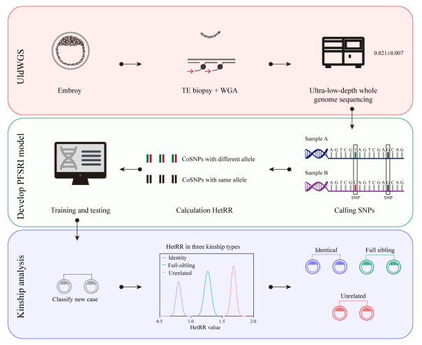

# README

# Overview

Assisted reproductive technology (**ART**) is an effective infertility treatment, and preimplantation genetic testing for aneuploidy (**PGT-A**) is applied to reduce aneuploid embryo transfer in ART cycles for groups including advanced maternal age, recurrent implantation failure, severe male factors, and couples with recurrent miscarriages and normal karyotypes. 

ART involves complex critical steps (oocyte retrieval, fertilization, embryo culture, embryo transfer), whose precise execution is essential; any human error may lead to embryo loss or serious issues like embryo/gamete misidentification, such as incorrect sperm use, non-target embryo transfer, genetic testing errors, and cryopreservation malfunctions. An HFEA report showed <1% adverse events in ~72,000 IVF cycles; a retrospective analysis of 36,654 IVF cycles (181,899 laboratory procedures) found 0.045% moderate and 0.23% significant nonconformities per procedure and cycle, respectively.

Various risk management and error mitigation strategies have been developed for IVF laboratories, including ESHRE SIG-recommended double-check mechanisms (e.g., second-person verification, barcode/RFID electronic identification) and comprehensive quality management systems (regular audits, data analysis, process optimization). Artificial intelligence (AI) technology also provides support for embryo tracking and data management to enhance quality control. 

Despite efforts to improve sample management and cycle traceability, current measures remain inadequate. Based on retrospective PGT-A data, we developed the preimplantation full-sibling relationship identification (**PFSRI**) model, a simple and accurate preimplantation kinship determination tool that classifies embryo relationships into full-sibling, unrelated, and identical categories. This model can early warn of potential IVF workflow errors and facilitate traceback/validation of embryos with abnormal relatedness.


These repositories provide methods and codes for PGT-A data  preprocessing, key metric calculation, model training, and performance  evaluation.

Using the **Heterozygosity-based Relationship Ratio (HetRR)** as the core feature and **Gaussian Naive Bayes (GNB)** algorithm, the model accurately classifies embryonic relationships into three categories: **identical, full-sibling, and unrelated**. The preimplantation full-sibling relationship identification (**PFSRI**) model model achieves near-perfect classification performance (AUROC > 0.99) and serves as a cost-effective, robust quality control and traceability tool for ART laboratories to prevent embryo mix-up and procedural  errors.

This model is designed to:

- Identify full-sibling, identical, and unrelated embryos
- Detect potential sample mix-up in IVF workflows
- Enable retrospective validation and traceability
- Integrate seamlessly into existing PGT-A pipelines **without additional cost**


### Flowchart of the research methodology

Using uldWGS data , the HetRR between two samples to be identified was calculated. Based on the HetRR, the PFSRI model was constructed, with the Gaussian Naive Bayes (GNB) machine learning algorithm adopted for model training and testing using the cohort dataset. Subsequently, the model was used to classify and evaluate the relatedness between embryo pairs, with reference to the HetRR thresholds established for three relationship types (full-sibling, unrelated, identical). 




### Software

The main software packages and their versions used in this repository are listed in the table below.
| Software                          | URL                                           |
| --------------------------------- | --------------------------------------------- |
| BWA mem (version: 0.7.17-r1188)   | https://github.com/lh3/bwa                    |
| Samtools (version: 1.11)          | https://github.com/samtools/samtools          |
| scikit-learn (version: 1.0.2)     | https://scikit-learn.org                      |
| pandas (version: 1.2.5)           | https://pandas.pydata.org                     |
| numpy (version: 1.25.2)           | https://numpy.org                             |
| matplotlib (version: 3.3.4)       | https://matplotlib.org                        |
| torch (version: 1.10.0)           | https://pytorch.org                           |
| R software (version: 4.2.0)       | https://www.r-project.org                     |
| PCCBS R package (version: 0.66.0) | https://cran.r-project.org/web/packages/PSCBS |


## 1. Data Collection

In this research, we conducted a retrospective analysis of PGT-A raw data derived from 789 embryos across 218 families. Among these embryos,  94.95% underwent trophectoderm (TE) biopsy on day 5, with the majority  displaying moderate morphological quality. The average sequencing depth  across all samples was 0.021 ± 0.007 . All TE  biopsy samples were processed using whole-genome amplification (WGA)  with a commercial kit (Jabrehoo, Beijing, China), followed by sequencing on the Illumina MiSeqDx platform.


## 2. Construction Of The Cohort Dataset

During the analysis, sample relatedness was initially categorized  according to their  family codes and sample IDs. Sample pairs  with matching family codes were preliminarily classified as full-sibling embryos, whereas pairs with differing family codes were regarded as  biologically unrelated. Those with identical matches in both family and  sample identifiers were defined as the same individual. The relatedness  assignments generated by the analytical model were then compared with  the preliminary classification results and clinically confirmed  outcomes.


## 3. Data Preprocessing & Quality Control

#### 3.1 Alignment And Calling SNPs

The uldWGS data of the research samples were first subjected to preliminary quality control procedures. Adapter  sequences, low-quality reads, and reads containing excessive ambiguous  bases (N) were removed using the Trimmomatic tool. The cleaned reads  were then aligned to the human reference genome assembly hg19 using the  BWA-MEM algorithm. Following alignment, the resulting BAM files were  sorted and processed to eliminate PCR duplicates using SAMtools,  retaining only uniquely mapped reads for downstream analysis.

```bash
# build reference index
bwa index hg19.fasta

############## Paired-end (PE) data ##############
trimmomatic PE -threads 4 \
    sample_R1.fastq.gz sample_R2.fastq.gz \
    sample_R1_clean.fastq.gz sample_R1_unpaired.fastq.gz \
    sample_R2_clean.fastq.gz sample_R2_unpaired.fastq.gz \
    ILLUMINACLIP:TruSeq3-PE.fa:2:30:10 \
    LEADING:20 TRAILING:20 \
    SLIDINGWINDOW:4:20 \
    MINLEN:50
    
bwa mem -t 4 \
  -R "@RG\tID=sample\tSM=sample\tLB=WGS\tPL=ILLUMINA" \
  hg19.fasta \
  sample_R1_clean.fastq.gz \
  sample_R2_clean.fastq.gz | \
  samtools sort -@ 4 -o sample.sorted.bam -
 
############## Single-end (SE) data ##############
trimmomatic SE -threads 4 \
    sample.fastq.gz \
    sample_clean.fastq.gz \
    ILLUMINACLIP:TruSeq3-SE.fa:2:30:10 \
    LEADING:20 TRAILING:20 \
    SLIDINGWINDOW:4:20 \
    MINLEN:50
    
bwa mem -t 4 \
  -R "@RG\tID=sample\tSM=sample\tLB=WGS\tPL=ILLUMINA" \
  hg19.fasta \
  sample_clean.fastq.gz | \
  samtools sort -@ 4 -o sample.sorted.bam -

# Remove PCR duplicates
samtools markdup -r -@ 4 sample.sorted.bam sample.sorted.rmdup.bam

# Generate index for BAM file
samtools index sample.sorted.rmdup.bam
```

Target SNPs were selected from the **dbSNP** database (build 151; https://hgdownload.soe.ucsc.edu/goldenPath/hg19/database/snp151Common.txt.gz). To expand the set of qualified SNPs for analysis, the minor allele  frequency cutoff was adjusted from the conventional threshold of  0.30 to 0.25 . The selected target SNPs were evenly distributed  across all 22 autosomal chromosomes. Reads encompassing these SNP loci  were randomly extracted from variant calling outputs, with each read  required to cover at least one target SNP. A minimum genomic distance of 50 bp between adjacent SNP loci was maintained to establish a  high‑quality read set for kinship prediction.

```bash
# Download
wget -c https://hgdownload.soe.ucsc.edu/goldenPath/hg19/database/snp151Common.txt.gz

# Extract the minor allele frequency (MAF) information of SNPs
python extract_maf.py -i snp151Common.txt.gz -o snp151Common.maf.txt

# Screening SNPs based on the minor allele frequency
zcat snp151Common.txt.gz|awk -F'\t' '$7 > 0.25 && $7 < 0.75 {print $0}' snp151Common.maf.txt > snp151_snp_0.25_0.75.list

# SNP bed File
awk -F'\t' -v OFS='\t' '{print $2, $3-1, $3}' common_snp_0.25_0.75.list > snp151_snp_0.25_0.75.bed
```

High-quality single-nucleotide polymorphisms (SNPs) were subsequently identified  using the **samtools** mpileup module with strict filtering criteria. Only  genomic positions with **base quality ≥ 20** and **mapping quality ≥ 20** were  retained to ensure reliable variant calling. These high-confidence  variants were used for subsequent genetic and quantitative analyses. In the HetRR.pl script, we integrated the code for SNP calling using Samtools. The analysis requires **.bed** files containing target SNPs filtered from the dbSNP database as input files.

```bash
samtools mpileup -q 20 -Q 20 -l snp151_snp_0.25_0.75.bed sample.sorted.rmdup.bam
```


#### 3.2 Calculation Of Heterozygosity-based Relationship Ratio (HetRR)

Within the constructed reads dataset, let the genotype of the *i*-th SNP in the query sample be composed of alleles *A* and *a*, with corresponding population frequencies *p<sub>i</sub>* and *q<sub>i</sub>*, where *p<sub>i</sub>* + *q<sub>i</sub>* = 1. The expected HetRR value under the hypothesis that two samples originate from the same individual is defined as:

$$ HetRR_e = \frac{\sum_{i=1}^n p_i q_i}{n} \tag{1} $$
where *HetRR<sub>e</sub>* denotes the expected HetRR value for identical samples, and *n* represents the total number of co‑detected SNPs (CoSNPs) between the two tested samples. The terms *p<sub>i</sub>* and *q<sub>i</sub>* correspond to the population frequencies of the two alleles at the *i*-th SNP locus.

The number of allelic inconsistencies between two samples is counted within the reads dataset, and the observed HetRR value is calculated using the following formula:
$$ HetRR_o = \frac{x}{n} \tag{2} $$
where *HetRR<sub>o</sub>* is the observed HetRR value, and *x* is the number of CoSNPs showing allelic differences between the two  tested samples. If multiple alleles are detected at a given SNP locus in one sample, a single allele is randomly selected for calculation.

The final HetRR value for the tested sample pair is determined by combining the observed and expected HetRR values as follows:
$$ HetRR = \frac{HetRR_o}{HetRR_e} \tag{3} $$
As shown in the table, the HetRR value in the row starting with "Total" is the average of HetRR values across autosomes 1 to 22, while CoDetSNPs and CoDetSNPs-Het represent the cumulative sums of the corresponding values.

```
Chr_id CoDetSNPs CoDetSNPs-Het Het_ratio(%) Expect-Het_ratio(%)	HetRR
Total	52206	19132	36.647	21.146	1.733
```


## 4. Model Training

#### 4.1 Dataset Construction

The balanced overall dataset was randomly divided into a training cohort and an independent testing cohort at a fixed ratio (7:3), with the majority of the data allocated for model training and the remaining portion reserved for model validation. Detailed sample counts and relationship category distributions corresponding to each cohort were strictly recorded, and the full construction and partitioning workflow of the cohort dataset is visually presented in Figure 1. All sample grouping and data partitioning processes were conducted under blinded conditions to avoid subjective interference, ensuring the objectivity and accuracy of subsequent model training and performance evaluation.

**The file format of the dataset is shown in the figure below.**

```bash
# Example
Sample Control_sample CoSNPs Sample_URs Control_Sample_URs HetRR Relationship
S100-01_E1	S101-01_E1	8381 2065016 2425610 1.672 unrelated
S100-01_E1	S101-02_E2	8127 2004085 2425610 1.734 unrelated
S100-01_E1	S101-03_E3	8077 2004378 2425610 1.639 unrelated
......
S102-01_E1	S102-01_E1RE 28006 1190950 1382609 0.839 Identical
S102-02_E2	S102-02_E2RE 31563 2014258 2019235 0.703 Identical
......
S103-01_E1	S103-02_E2	7102 2004085 1896170 1.340 full-sibling
S103-01_E1	S103-03_E3	6992 1770064 2425610 1.241 full-sibling
......
```


#### 4.2 Calculation of Posterior Probabilities Across Relationship Types

The PFSRI model was constructed using the multi-class Gaussian Naive Bayes  (GNB) algorithm based on the HetRR values derived from embryo  comparisons. This algorithm estimates the posterior probabilities for  three types of genetic relationships: full-sibling, unrelated, and  identical pairs. The relationship with the highest predicted probability is assigned as the final kinship classification result.

The prior probability for each relationship category is determined as the  percentage of samples belonging to that category relative to the total  number of samples in the dataset, which can be expressed as:
$$ P(y) = \frac{S}{N} \times 100\% \tag{4} $$
where P(y) represents the prior probability of relationship class y, N denotes the total number of sample pairs, and S is the number of sample pairs classified into relationship y.

For continuous variables such as HetRR, each feature is assumed to follow a normal distribution within each relationship category. The conditional  probability is then computed using the corresponding probability density function:
$$ P(x_i \mid y) = \frac{1}{\sqrt{2\pi\sigma_{y,i}^2}} e^{ -\frac{(x_i - \mu_{y,i})^2}{2\sigma_{y,i}^2} } \tag{5} $$
where P(xi∣y) is the conditional probability of observing the HetRR value xi given relationship category y, μy,i is the mean HetRR value for class y, and σy,i2 is the corresponding variance.

In the GNB framework, classification relies on comparing relative  posterior probabilities rather than their absolute magnitudes. As a  result, the marginal probability term in the denominator can be omitted. The posterior probability for relationship category y is thus simplified to:
$$ P(y \mid x) = P(x_i \mid y) \times P(y) \tag{6} $$
For each sample pair, posterior probabilities are calculated across the  three relationship types (full-sibling, unrelated, and identical). The  pair is assigned to the category with the maximum posterior probability, yielding the final kinship prediction:
$$ \hat{y} = \arg\max_{y \in Y} P(y \mid x) \tag{7} $$


#### 4.3 **Training of the Model**

The PFSRI model was constructed using the HetRR feature values and  Gaussian Naive Bayes algorithm. To evaluate its performance, 5-fold  cross-validation was applied to the training cohort: in each iteration,  four folds served as the training subset, and the remaining one for  parameter tuning. The area under the receiver operating characteristic  curve (**AUROC**) was calculated for both training and testing cohorts. 

```python
python cross_validation.py -i raw_data.txt -o ./cross_validation -s "7:3"
```

All machine-learning workflows are implemented using **Python 3.9.7** and **scikit-learn 1.0.2**.


#### 4.4 **Evaluation of Model Performance**

##### 4.4.1 Impact of UR and CoSNPs Thresholds on Model Prediction Results

To  determine the optimal quality control cutoff, the training and testing  cohorts were divided into six  groups based on increasing thresholds of unique reads (UR) and  co-detected SNPs (CoSNPs): (A) UR ≥ 200 K, CoSNPs ≥ 200; (B) UR ≥ 400 K, CoSNPs ≥ 400; (C) UR ≥ 600 K, CoSNPs ≥ 600; (D) UR ≥ 800 K, CoSNPs ≥  800; (E) UR ≥ 1000 K, CoSNPs ≥ 1000; (F) UR ≥ 1200 K, CoSNPs ≥ 1200. For each group, the model’s predictive performance was evaluated using  precision, recall, and F1 score across three kinship categories  (full-sibling, unrelated, identical). The final model was selected at  the lowest threshold that achieved stable and optimal performance.  Additionally, the distribution of HetRR values among the three kinship  categories was analyzed to verify the model’s classification accuracy  and discriminatory power.

The result demonstrate that under ultra-uldWGS, the thresholds of UR ≥ 800 K and  CoSNPs ≥ 800 enable precise discrimination among  full-sibling, unrelated, and identical relationships. After rigorous  cost-accuracy assessment, UR≥800 K and CoSNPs≥800 were identified as the optimal parameter thresholds for PFSRI deployment, offering a reliable  quantitative foundation for preimplantation kinship testing.

```python
python train_model.py -i raw_data.txt -o ./Model_UR-200_CoSNPs-200 -u 200 -c 200 -s "7:3"
python train_model.py -i raw_data.txt -o ./Model_UR-400_CoSNPs-400 -u 400 -c 400 -s "7:3"
python train_model.py -i raw_data.txt -o ./Model_UR-600_CoSNPs-600 -u 600 -c 600 -s "7:3"
python train_model.py -i raw_data.txt -o ./Model_UR-800_CoSNPs-800 -u 800 -c 800 -s "7:3"
python train_model.py -i raw_data.txt -o ./Model_UR-1200_CoSNPs-1200 -u 1200 -c 1200 -s "7:3"

python model_evaluation.py -i raw_data.txt -o ./Model_evaluation -s "7:3"
```


##### 4.4.2 Impact of Embryo Ploidy Status on Model Prediction Results

To assess the potential impact of PGT-A results on embryonic kinship  prediction, we analyzed the ploidy status (euploid vs. aneuploid) of  embryos in the final PFSRI model dataset. ‘Aneuploid’ included both  whole and segmental chromosome abnormalities, such as whole/segmental  chromosomal gain or loss and whole/segmental mosaic gain or loss. Within each of the three kinship groups (full-sibling, unrelated, identical),  we statistically analyzed and compared the HetRR values of  euploid-euploid, euploid-aneuploid, and aneuploid-aneuploid sample  pairs.  

These results indicate that embryonic chromosomal copy number abnormalities do not interfere with the accuracy of kinship prediction based on HetRR features, validating the robustness of the PFSRI model under complex chromosomal backgrounds.

```python
python model_predict.py -i test_sample.txt -b ./Bam_dir -o ./Model_predict -m /path/bayes_model.joblib
```


## Limitations

- Single-center cohort; multi-center validation is recommended
- Optimal thresholds (UR ≥ 800K, CoSNPs ≥ 800) require further validation
- SNP panel has population specificity
